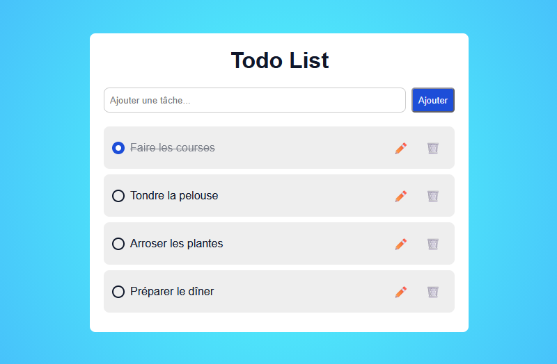

# 📝 Todo List

Projet personnel réalisé en **HTML, CSS et Vanilla JavaScript**.

Cette application web permet de gérer une liste de tâches en ajoutant, modifiant, supprimant et marquant les tâches comme terminées.

## 🖼️ Aperçu

## 🎯 Fonctionnalités

La Todo List permet de :

- ajouter une nouvelle tâche
- modifier une tâche existante
- supprimer une tâche
- marquer une tâche comme terminée
- afficher visuellement les tâches terminées
- conserver les tâches dans le navigateur après le rechargement de la page

L'interface est responsive et s'adapte aux différentes tailles d'écran.

## ⚙️ Fonctionnement

Les tâches sont gérées en JavaScript et enregistrées dans le **LocalStorage** du navigateur au format JSON.

Lorsqu'une action est effectuée sur une tâche, le JavaScript :

1. met à jour les données
2. enregistre les modifications dans le LocalStorage
3. actualise l'affichage de la liste

Lors du chargement de la page, les tâches enregistrées dans le LocalStorage sont récupérées afin de restaurer la liste.

## 🛠️ Technologies

- **HTML5**
- **CSS3**
- **Vanilla JavaScript**
- **Git**

## 🚀 Lancer le projet

Aucune installation ou dépendance n'est nécessaire.

1. Cloner ou télécharger le dépôt.
2. Ouvrir le fichier `index.html` dans un navigateur.
